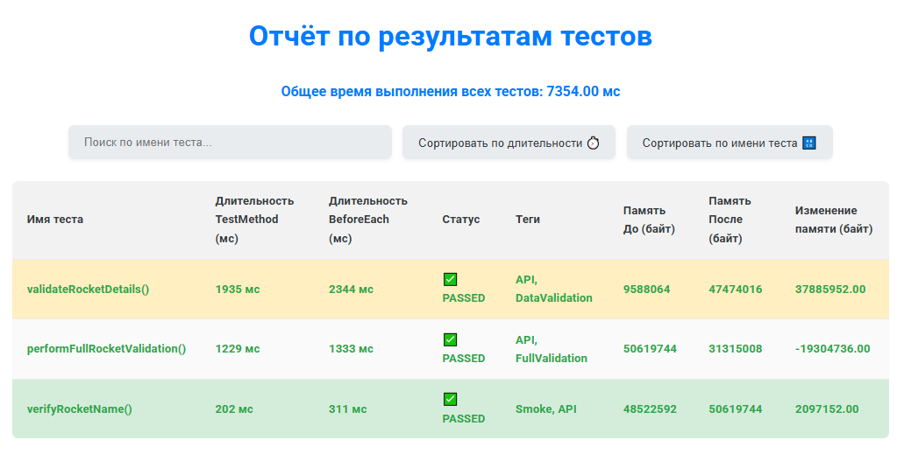
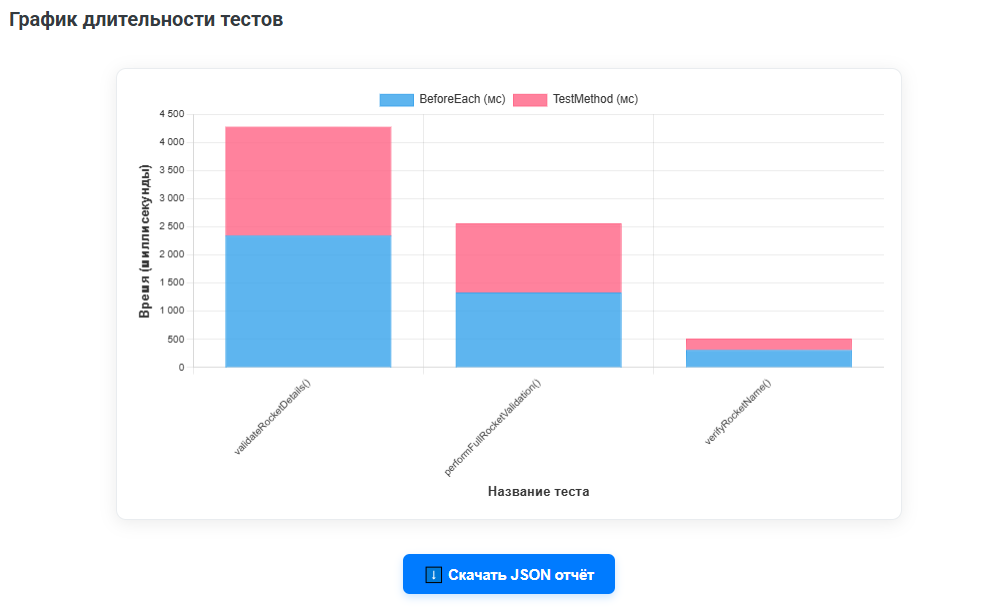

# test-analyzer

Java библиотека для измерения и логирования времени выполнения тестов с помощью JUnit 5 Extension.

---

## Что это?

`test-analyzer` — это лёгкая и удобная библиотека, которая позволяет автоматически измерять время выполнения каждого теста в JUnit 5 и выводить эту информацию в консоль. Это помогает быстро выявлять медленные тесты и улучшать качество автотестов.

---

## Демонстрация работы

Взгляните, как выглядит сгенерированный HTML-отчёт:

### Обзор результатов тестов

Здесь вы увидите общую сводку времени выполнения и подробную таблицу с метриками для каждого теста: 
**длительность выполнения тестового метода (`TestMethod`), время подготовки (`BeforeEach`), статус, теги и изменение памяти**.  



### Визуализация длительности тестов

График наглядно показывает, какие тесты занимают больше всего времени, с разбивкой на `BeforeEach` и `TestMethod` фазы.  



---

## Как использовать?

### 1. Подключите зависимость к своему проекту

(Пока библиотека не опубликована в Maven Central, подключайте через JitPack)

#### Шаг 1. Добавьте JitPack репозиторий в settings.gradle
```groovy
dependencyResolutionManagement {
repositoriesMode.set(RepositoriesMode.FAIL_ON_PROJECT_REPOS)
repositories {
mavenCentral()
maven { url 'https://jitpack.io' }
}
}
```

#### Шаг 2. Добавьте зависимость в build.gradle
```groovy
dependencies {
    implementation 'com.github.makurea:test-analyzer:main-SNAPSHOT'
}
```
#### Шаг 3. Соберите библиотеку:
```bash
./gradlew build
```

### 2. Добавьте расширение к вашим тестам
```java
   import dev.makurea.testanalyzer.core.TestTimerExtension;
   import org.junit.jupiter.api.extension.ExtendWith;

@ExtendWith(TestTimerExtension.class)
public class YourTestClass {

    @Test
    void exampleTest() throws InterruptedException {
        Thread.sleep(200);
        Assertions.assertTrue(true);
    }
}
```

### 3. Запустите тесты и смотрите вывод в консоли
```scss
   [TestTimer] exampleTest() BeforeEach executed in 10 ms
   [TestTimer] exampleTest() Test method executed in 200 ms
   [TestTimer] Отчёт создан: build/test-analyzer-reports/test-timer-report.html
```

### 4. Откройте HTML-отчёт

После запуска тестов в папке build/test-analyzer-reports появятся файлы:
 - `test-timer-results.json` — данные по замерам в формате JSON
 - `test-timer-report.html` — красивый интерактивный отчёт с графиками

Откройте `test-timer-report.html` в браузере для анализа.

---

## Планы на будущее😉

 - Расширенные метрики и аналитика.
 - Интеграция с CI/CD-системами для автоматической публикации отчётов.
 - Улучшенный UI/UX отчётов.
 - Дополнительные опции кастомизации.

---

## Лицензия
MIT License © makurea

